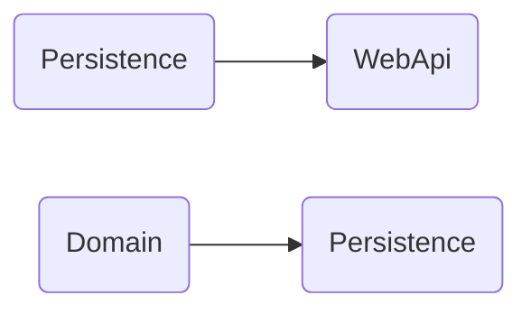

# Dosya yapısı

```markdown
.
├── src
│   ├── Core
│   │   ├── Deneme.Application
│   │   │   └── Deneme.Application.csproj
│   │   └── Deneme.Domain
│   │       ├── Common
│   │       │   └── BaseEntity.cs
│   │       ├── Entities
│   │       │   ├── Campaign.cs
│   │       │   ├── CartProduct.cs
│   │       │   ├── Order.cs
│   │       │   └── Product.cs
│   │       └── Deneme.Domain.csproj
│   ├── Infrastrucute
│   │   └── Deneme.Persistence
│   │       ├── Context
│   │       │   └── AppDbContext.cs
│   │       ├── Migrations
│   │       └── Deneme.Persistence.csproj
│   └── WebApi
│       └── Deneme.WebApi
│           ├── Controllers
│           ├── Properties
│           │   └── launchSettings.json
│           ├── appsettings.Development.json
│           ├── appsettings.json
│           ├── Deneme.WebApi.csproj
│           └── Program.cs
└── Deneme.sln
```
# Dosyalar

## BaseEntitiy.cs

```csharp
using System;
using System.Collections.Generic;
using System.Linq;
using System.Text;
using System.Threading.Tasks;

namespace Deneme.Domain.Common
{
    public class BaseEntity
    {
        public int Id { get; set; }
        public DateTime CreatedDate { get; set; } = DateTime.Now;
        public DateTime UpdatedDate { get; set; }
        public Boolean IsActive { get; set; }
    }
}
```

## Campaign.cs

```csharp
using Deneme.Domain.Common;
using System;
using System.Collections.Generic;
using System.Linq;
using System.Text;
using System.Threading.Tasks;

namespace Deneme.Domain.Entities
{
    public class Campaign : BaseEntity
    {

        public string Title { get; set; } = string.Empty;
        public string Description { get; set; } = string.Empty;
        public DateTime StartDate { get; set; }
        public DateTime EndDate { get; set; }
        public decimal DiscountValue { get; set; }
    }
}
```

## CartProduct.cs

```csharp
using Deneme.Domain.Common;
using System;
using System.Collections.Generic;
using System.Linq;
using System.Text;
using System.Threading.Tasks;

namespace Deneme.Domain.Entities
{
    public class CartProduct : BaseEntity
    {
        public int Quantity { get; set; }
        public string Sku { get; set; }

    }
}
```

## Order.cs

```csharp
using Deneme.Domain.Common;
using System;
using System.Collections.Generic;
using System.Linq;
using System.Text;
using System.Threading.Tasks;

namespace Deneme.Domain.Entities
{
    public class Order : BaseEntity
    {
        public Guid OrderId { get; set; }
        public int PersonId { get; set; }
        public List<CartProduct> Cart { get; set; }

    }
}
```

## Product.cs

```csharp
using Deneme.Domain.Common;
using System;
using System.Collections.Generic;
using System.Linq;
using System.Text;
using System.Threading.Tasks;

namespace Deneme.Domain.Entities
{
    public class Product : BaseEntity
    {
        public string Sku { get; set; }
        public string Name { get; set; }
        public string Description { get; set; } 
        public decimal Price { get; set; }
        public int StockCount { get; set; } 
        public int? DiscountedPrice { get; set; }
    }
}
```

## AppDbContext.cs

```csharp
using Deneme.Domain.Entities;
using Microsoft.EntityFrameworkCore;
using System;
using System.Collections.Generic;
using System.Linq;
using System.Text;
using System.Threading.Tasks;

namespace Persistance.Context
{
    public class AppDbContext : DbContext
    {
        public AppDbContext(DbContextOptions options) : base(options) { }

        public DbSet<Order> Orders { get; set; }
        public DbSet<Product> Products { get; set; }
        public DbSet<CartProduct> Carts { get; set; }
        public DbSet<Campaign> Campaigns { get; set; }
    }
}
```

## Program.cs

```csharp
using Microsoft.EntityFrameworkCore;
using Persistance.Context;

var builder = WebApplication.CreateBuilder(args);

builder.Services.AddControllers();
builder.Services.AddEndpointsApiExplorer();

builder.Services.AddSwaggerGen();

var connectionString = builder.Configuration.GetConnectionString("DefaultConnection");
builder.Services.AddDbContext<AppDbContext>(options => options.UseNpgsql(connectionString)); 

var app = builder.Build();

if (app.Environment.IsDevelopment())
{
    app.UseSwagger();
    app.UseSwaggerUI();
}

app.UseHttpsRedirection();

app.UseAuthorization();

app.MapControllers();

app.Run();
```

## appsettings.cs

```json
{
  "Logging": {
    "LogLevel": {
      "Default": "Information",
      "Microsoft.AspNetCore": "Warning"
    }
  },
  "AllowedHosts": "*",
  "ConnectionStrings": {
    "DefaultConnection": "Host=localhost;Port=5432;User ID=postgres;Password=f.1234;Database=db_deneme;Pooling=true;"
  }
}
```

# Kullanılan Paketler

## Deneme.Dersistence

```powershell
dotnet add package Microsoft.EntityFrameworkCore
dotnet add package Npgsql.EntityFrameworkCore.PostgreSQL
```

## Deneme.WebApi

```powershell
dotnet add package Microsoft.EntityFrameworkCore.Design
```

# Proje Referansları



# Proje komutları

## Migration

```powershell
dotnet ef migrations add init --startup-project .\Deneme\src\WebApi\Deneme.WebApi\ --project .\Deneme\src\Infrastrucute\Deneme.Persistence\
```

## Update Database

```powershell
dotnet ef database update --startup-project .\Deneme\src\WebApi\Deneme.WebApi\ --project .\Deneme\src\Infrastrucute\Deneme.Persistence\
```
