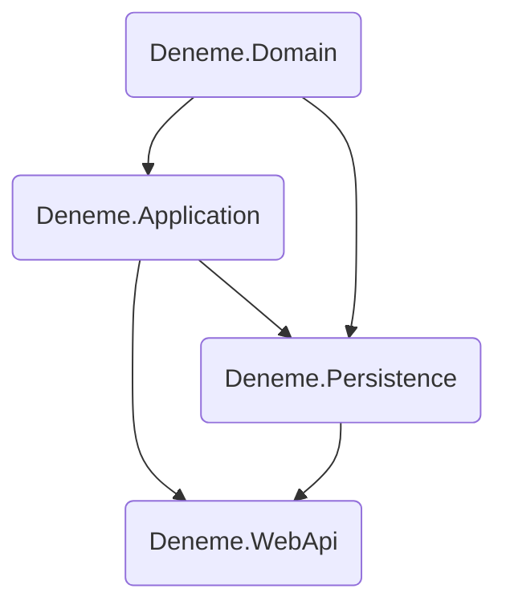

# Dosya yapısı

```
.
├── src
│   ├── Core
│   │   ├── Deneme.Application
│   │   │   ├── Dtos
│   │   │   │   ├── ProductRequest.cs
│   │   │   │   └── UpdateRequest.cs
│   │   │   ├── Interfaces
│   │   │   │   └── Repositories
│   │   │   │       ├── ICampaignRepository.cs
│   │   │   │       ├── IGenericRepository.cs
│   │   │   │       ├── IOrderRepository.cs
│   │   │   │       └── IProductRepository.cs
│   │   │   └── Deneme.Application.csproj
│   │   └── Deneme.Domain
│   │       ├── Common
│   │       │   └── BaseEntity.cs
│   │       ├── Entities
│   │       │   ├── Campaign.cs
│   │       │   ├── CartProduct.cs
│   │       │   ├── Order.cs
│   │       │   └── Product.cs
│   │       └── Deneme.Domain.csproj
│   ├── Infrastrucute
│   │   └── Deneme.Persistence
│   │       ├── Context
│   │       │   └── AppDbContext.cs
│   │       ├── Migrations
│   │       │   ├── 20230816191107_init.cs
│   │       │   ├── 20230816191107_init.Designer.cs
│   │       │   └── AppDbContextModelSnapshot.cs
│   │       ├── Repositories
│   │       │   ├── CampaignRepository.cs
│   │       │   ├── GenericRepository.cs
│   │       │   ├── OrderRepository.cs
│   │       │   └── ProductRepository.cs
│   │       └── Deneme.Persistence.csproj
│   └── WebApi
│       └── Deneme.WebApi
│           ├── Controllers
│           │   └── ProductController.cs
│           ├── Properties
│           │   └── launchSettings.json
│           ├── appsettings.Development.json
│           ├── appsettings.json
│           ├── Deneme.WebApi.csproj
│           └── Program.cs
├── .gitignore
├── Deneme.sln
└── README.md
```
# Dosyalar
## Core / Deneme.Application / Dtos

### ProductRequest.cs

```csharp
using System;
using System.Collections.Generic;
using System.Linq;
using System.Text;
using System.Threading.Tasks;

namespace Deneme.Application.Dtos
{
    public class ProductRequest
    {
        public string Sku { get; set; }
        public string Name { get; set; }
        public string Description { get; set; }
        public decimal Price { get; set; }
        public int StockCount { get; set; }
    }
}
```

### UpdateRequest.cs

```csharp
using System;
using System.Collections.Generic;
using System.Linq;
using System.Text;
using System.Threading.Tasks;

namespace Deneme.Application.Dtos
{
    public class UpdateRequest
    {
        public int Id { get; set; }
        public decimal Price { get; set; }
        public int StockCount { get; set; }
    }
}
```

## Core / Deneme.Application / Interfaces / Repositories

### IGenericRepository.cs

```csharp
using Deneme.Domain.Common;
using System;
using System.Collections.Generic;
using System.Linq;
using System.Text;
using System.Threading.Tasks;

namespace Deneme.Application.Interfaces.Repositories
{
    public interface IGenericRepository<TEntity> where TEntity : BaseEntity
    {
        Task<List<TEntity>> GetAll();
        Task<TEntity> GetById(int id);
        Task<TEntity> Create(TEntity entity);
        Task<TEntity> Update(TEntity entity);
    }
}
```

## Core / Deneme.Domain / Common

### BaseEntitiy.cs

```csharp
using System;
using System.Collections.Generic;
using System.Linq;
using System.Text;
using System.Threading.Tasks;

namespace Deneme.Domain.Common
{
    public class BaseEntity
    {
        public int Id { get; set; }
        public DateTime CreatedDate { get; set; } = DateTime.Now;
        public DateTime UpdatedDate { get; set; }
        public Boolean IsActive { get; set; }
    }
}
```

## Core / Deneme.Domain / Entities

### Campaign.cs

```csharp
using Deneme.Domain.Common;
using System;
using System.Collections.Generic;
using System.Linq;
using System.Text;
using System.Threading.Tasks;

namespace Deneme.Domain.Entities
{
    public class Campaign : BaseEntity
    {

        public string Title { get; set; } = string.Empty;
        public string Description { get; set; } = string.Empty;
        public DateTime StartDate { get; set; }
        public DateTime EndDate { get; set; }
        public decimal DiscountValue { get; set; }
    }
}
```

### CartProduct.cs

```csharp
using Deneme.Domain.Common;
using System;
using System.Collections.Generic;
using System.Linq;
using System.Text;
using System.Threading.Tasks;

namespace Deneme.Domain.Entities
{
    public class CartProduct : BaseEntity
    {
        public int Quantity { get; set; }
        public string Sku { get; set; }

    }
}
```

### Order.cs

```csharp
using Deneme.Domain.Common;
using System;
using System.Collections.Generic;
using System.Linq;
using System.Text;
using System.Threading.Tasks;

namespace Deneme.Domain.Entities
{
    public class Order : BaseEntity
    {
        public Guid OrderId { get; set; }
        public int PersonId { get; set; }
        public List<CartProduct> Cart { get; set; }

    }
}
```

### Product.cs

```csharp
using Deneme.Domain.Common;
using System;
using System.Collections.Generic;
using System.Linq;
using System.Text;
using System.Threading.Tasks;

namespace Deneme.Domain.Entities
{
    public class Product : BaseEntity
    {
        public string Sku { get; set; }
        public string Name { get; set; }
        public string Description { get; set; } 
        public decimal Price { get; set; }
        public int StockCount { get; set; } 
        public int? DiscountedPrice { get; set; }
    }
}
```

## Infrastrucute / Deneme.Persistance / Context

### AppDbContext.cs

```csharp
using Deneme.Domain.Entities;
using Microsoft.EntityFrameworkCore;
using System;
using System.Collections.Generic;
using System.Linq;
using System.Text;
using System.Threading.Tasks;

namespace Persistance.Context
{
    public class AppDbContext : DbContext
    {
        public AppDbContext(DbContextOptions options) : base(options) { }

        public DbSet<Order> Orders { get; set; }
        public DbSet<Product> Products { get; set; }
        public DbSet<CartProduct> Carts { get; set; }
        public DbSet<Campaign> Campaigns { get; set; }
    }
}
```

## Infrastrucute / Deneme.Persistance / Repositories

### GenericRepository.cs

```csharp
using Deneme.Application.Interfaces.Repositories;
using Deneme.Domain.Common;
using Microsoft.EntityFrameworkCore;
using Persistance.Context;
using System;
using System.Collections.Generic;
using System.Linq;
using System.Text;
using System.Threading.Tasks;

namespace Deneme.Persistence.Repositories
{
    public class GenericRepository<TEntity> : IGenericRepository<TEntity> where TEntity : BaseEntity
    {
        private readonly AppDbContext _appDbContext;

        public GenericRepository(AppDbContext appDbContext)
        {
            _appDbContext = appDbContext;
        }

        public Task<TEntity> Create(TEntity entity)
        {
            TEntity data = _appDbContext.Add(entity).Entity;
            _appDbContext.SaveChanges();

            return Task.FromResult(data);
        }

        public Task<TEntity> GetById(int id)
        {
            TEntity data = _appDbContext.Set<TEntity>().FirstOrDefault(p => p.Id == id);

            return Task.FromResult(data);

        }

        public Task<List<TEntity>> GetAll()
        {
            List<TEntity> Entities = _appDbContext.Set<TEntity>().ToList();

            return Task.FromResult(Entities);
        }

        public Task<TEntity> Update(TEntity entity)
        {
            _appDbContext.Attach(entity);

            TEntity data = _appDbContext.Update(entity).Entity;

            _appDbContext.SaveChanges();

            return Task.FromResult(data);
        }
    }
}
```

## WebApi / Deneme.WebApi / Controllers

### ProductController.cs

```csharp
using Deneme.Application.Dtos;
using Deneme.Domain.Entities;
using Microsoft.AspNetCore.Mvc;
using Persistance.Context;

namespace Deneme.WebApi.Controllers
{
    [Route("api/products")]
    [ApiController]
    public class ProductController : Controller
    {
        private readonly AppDbContext _context;

        public ProductController(AppDbContext context)
        {
            _context = context;
        }

        [HttpGet("GetProductList")]
        public List<Product> GetProducts()
        {
            var products = _context.Products.ToList();

            return products;
        }

        [HttpGet]
        public IActionResult GetProduct(int id)
        {
            var data = _context.Products.FirstOrDefault(p => p.Id == id);

            if (data == null)
            {
                return NotFound();
            }

            return Ok(data);
        }

        [HttpPost]
        public IActionResult CreateProduct([FromBody] ProductRequest product)
        {
            if (product == null)
            {
                return BadRequest();
            }

            var entity = new Product()
            {
                Sku = product.Sku,
                Name = product.Name,
                Description = product.Description,
                Price = product.Price,
                StockCount = product.StockCount,

            };

            Product response = _context.Add(entity).Entity;
            _context.SaveChanges();

            return Ok(response);
        }

        [HttpPut]
        public IActionResult UpdateProduct([FromBody] UpdateRequest product)
        {
            var data = _context.Set<Product>().FirstOrDefault(p => p.Id == product.Id);

            if (data == null)
            {
                return NotFound();
            }

            data.Price = product.Price;
            data.StockCount = product.StockCount;
            data.UpdatedDate = DateTime.UtcNow;

            Product response = _context.Update(data).Entity;
            _context.SaveChanges();

            return Ok(response);

        }

        [HttpDelete]
        public IActionResult DeleteProduct([FromQuery] int Id) {

            var data = _context.Set<Product>().FirstOrDefault(p => p.Id == Id);

            if (data == null)
            {
                return NotFound();
            }
            data.IsActive = false;

            _context.Update(data);
            _context.SaveChanges();

            return Ok();
        }
    }
}

```

## WebApi / Deneme.WebApi

### Program.cs

```csharp
using Microsoft.EntityFrameworkCore;
using Persistance.Context;

var builder = WebApplication.CreateBuilder(args);

builder.Services.AddControllers();
builder.Services.AddEndpointsApiExplorer();

builder.Services.AddSwaggerGen();

var connectionString = builder.Configuration.GetConnectionString("DefaultConnection");
builder.Services.AddDbContext<AppDbContext>(options => options.UseNpgsql(connectionString)); 

var app = builder.Build();

if (app.Environment.IsDevelopment())
{
    app.UseSwagger();
    app.UseSwaggerUI();
}

app.UseHttpsRedirection();

app.UseAuthorization();

app.MapControllers();

app.Run();
```

### appsettings.cs

```json
{
  "Logging": {
    "LogLevel": {
      "Default": "Information",
      "Microsoft.AspNetCore": "Warning"
    }
  },
  "AllowedHosts": "*",
  "ConnectionStrings": {
    "DefaultConnection": "Host=localhost;Port=5432;User ID=postgres;Password=f.1234;Database=db_deneme;Pooling=true;"
  }
}
```

# Kullanılan Paketler

## Deneme.Dersistence

```powershell
dotnet add package Microsoft.EntityFrameworkCore
dotnet add package Npgsql.EntityFrameworkCore.PostgreSQL
```

## Deneme.WebApi

```powershell
dotnet add package Microsoft.EntityFrameworkCore.Design
```

# Proje Referansları



# Proje komutları

## Migration

```powershell
dotnet ef migrations add init --startup-project .\Deneme\src\WebApi\Deneme.WebApi\ --project .\Deneme\src\Infrastrucute\Deneme.Persistence\
```

## Update Database

```powershell
dotnet ef database update --startup-project .\Deneme\src\WebApi\Deneme.WebApi\ --project .\Deneme\src\Infrastrucute\Deneme.Persistence\
```
